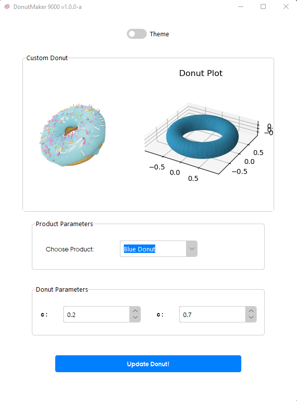

# Small tkinter GUI template

 

_A repo for having a good starting template for a tkinter gui in python._

---

For the widget themes i kindly used the Azure theme found here: https://github.com/rdbende/Azure-ttk-theme

Use this repo as starting foundation for building your own app.
 
 
## How to use
 * Clone the repo or download it
 * Play around with adding your own icons, your own splash screen, change the widgets etc. 
 * Use Pyinstaller when you are done, to create an exe file that everyone who does not have python installed can run and share it as a tool that your colleagues or co-students can use :-) 

Splash Screen:

Main window:

## Bugs
 - no 
